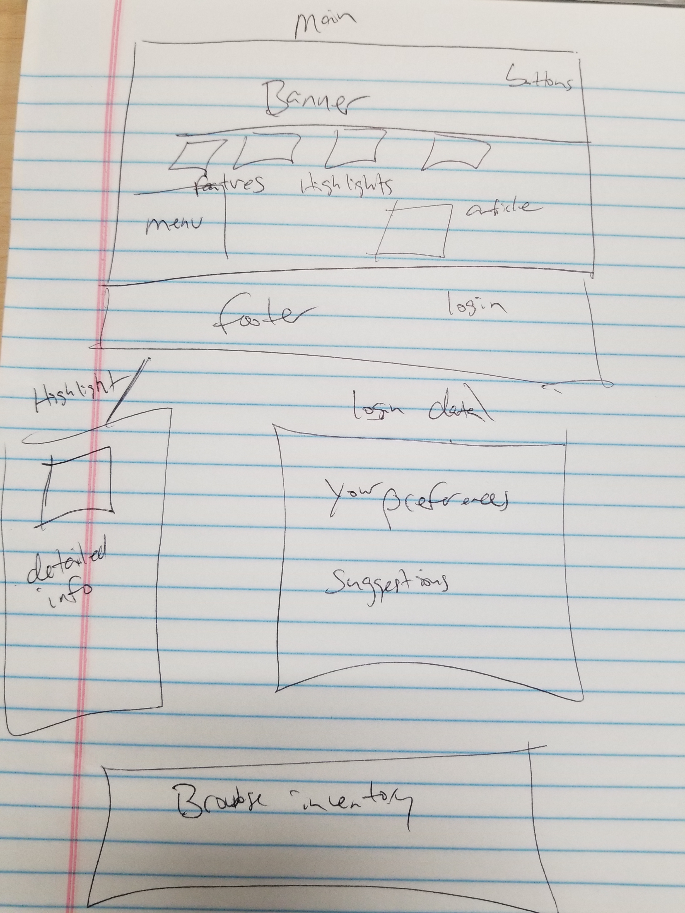

# Project 2

## Title

TBD

## Description

A web application that will use a database and API to provide medical marihuana strains and information so patients can keep track of dosage, effects, strains and notes to aid themselves and their doctors as they take their medication.

## Initial Designs

## Team Member and Roles

Jonatan and Nicholas - Back-end
Jason and Joao - Front-end

## Technologies used

We expect to use:

HTML, CSS, JQuery, Materialize CSS, NodeJs, Express, Sequelize, APIs, Passport and potentially other technologies. We will use GitHub for project management. 

## Breakdown of Task

TBD

